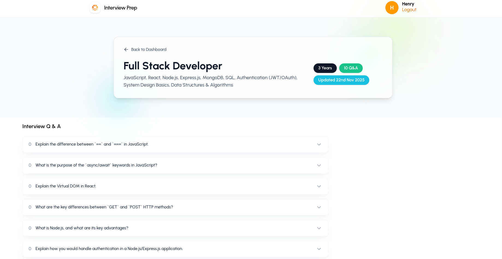
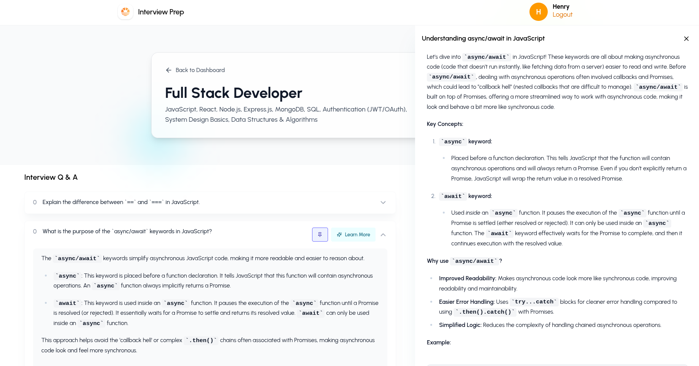

# Interview-Ready AI App

A full-stack web application to help users prepare for technical interviews using AI-powered question generation, timed practice sessions, and personalized session management.

> **Note:** This project is under active development. Some features may be in progress or subject to change.

---

## Table of Contents

- [Project Overview](#project-overview)
- [Screenshots](#screenshots)
- [Features](#features)
- [Tech Stack](#tech-stack)
- [Architecture](#architecture)
- [API Reference](#api-reference)
- [Authentication Flow](#authentication-flow)
- [Environment Variables](#environment-variables)
- [Setup & Run](#setup--run)

---

## Project Overview

Interview-Ready AI App helps users prepare for technical interviews by:

- Creating and managing practice sessions
- Generating AI-powered interview questions and concept explanations (via Google Gemini)
- Pinning, noting, and reviewing questions per session
- Secure user authentication with profile picture support

The repo is split into two main folders:

- `backend/` — TypeScript + Express API (controllers, services, Mongoose models, middlewares)
- `frontend/` — React + Vite SPA (pages, components, Tailwind v4 styling)

---

## Screenshots

### Landing Page


### Application Interface



### Learn More



---

## Features

- **Authentication** — Secure signup/login with HTTPOnly cookie JWTs and automatic token refresh
- **CSRF Protection** — Double-submit pattern via `csrf-csrf`
- **Practice Sessions** — Create, view, and delete timed mock interview sessions
- **Question Management** — Add questions to sessions, pin important ones, attach personal notes
- **AI Assistance** — Generate interview questions and concept explanations via Gemini API
- **Profile Pictures** — Upload and store images via Cloudinary
- **Rate Limiting** — Per-route rate limiting on auth endpoints

---

## Tech Stack

### Backend

| Concern | Technology |
|---|---|
| Runtime | Node.js + TypeScript |
| Framework | Express v5 |
| Database | MongoDB (Mongoose v8) |
| Auth | JWT (`jsonwebtoken`), `bcryptjs`, HTTPOnly cookies |
| Security | `helmet`, `csrf-csrf`, `express-rate-limit`, `cors` |
| AI | `@google/genai` (Google Gemini) |
| File Uploads | `multer` (buffer) + Cloudinary |
| Validation | Zod v4 |
| Dev Tools | `ts-node-dev`, ESLint, Prettier |

### Frontend

| Concern | Technology |
|---|---|
| Framework | React v19 + TypeScript (Vite v6) |
| Styling | TailwindCSS v4 (`@tailwindcss/vite`) |
| Animations | Framer Motion v12 |
| Routing | React Router DOM v7 |
| HTTP | Axios (`withCredentials: true`) |
| Notifications | `goey-toast` |
| Icons | `react-icons` v5 |
| Markdown | `react-markdown`, `remark-gfm`, `react-syntax-highlighter` |
| Validation | Zod v4 |

---

## Architecture

### Backend Structure

```
backend/src/
├── index.ts              # Server entry — middleware stack, routes, error handler
├── config/
│   ├── db.ts             # MongoDB connection with retry
│   ├── serverConfig.ts   # helmet, cors, rate-limit configs
│   ├── csrf.ts           # csrf-csrf double-submit setup
│   └── cloudinary.ts     # Cloudinary SDK init
├── controllers/          # Request handlers (auth, ai, questions, sessions)
├── services/             # Business logic layer
├── models/               # Mongoose schemas (User, Question, Session)
├── middlewares/          # protect (JWT), requestLogger, validateRequest, upload
├── routes/               # Route definitions
├── schemas/              # Zod validation schemas
├── types/                # Shared TypeScript types
└── utils/                # env, AppError, catchAsync, errorHandler, responseHandler
```

### Frontend Structure

```
frontend/src/
├── App.tsx               # Router + GoeyToaster
├── context/
│   └── userContext.tsx   # Global user auth state
├── pages/
│   ├── LandingPage/
│   ├── Auth/             # Login & Register forms
│   ├── Home/             # Dashboard
│   └── InterviewPrep/    # Active session page
├── components/           # Reusable UI (Navbar, Modal, Drawer, QuestionCard, etc.)
└── utils/
    ├── axios.ts          # Axios instance with CSRF + 401 refresh interceptors
    └── apiPaths.ts       # Centralized API path constants
```

---

## API Reference

### Auth — `/api/auth`

| Method | Path | Description | Auth |
|---|---|---|---|
| `POST` | `/register` | Create new user, sets cookies | — |
| `POST` | `/login` | Login, sets cookies | — |
| `GET` | `/profile` | Get current user profile | ✅ |
| `POST` | `/logout` | Clear auth cookies | ✅ |
| `POST` | `/refresh` | Rotate access token via refresh cookie | — |
| `POST` | `/upload-image` | Upload profile picture to Cloudinary | — |

### Sessions — `/api/sessions`

| Method | Path | Description |
|---|---|---|
| `POST` | `/create` | Create a new practice session |
| `GET` | `/my-sessions` | List all sessions for current user |
| `GET` | `/:id` | Get session details |
| `DELETE` | `/:id` | Delete a session |

### Questions — `/api/questions`

| Method | Path | Description |
|---|---|---|
| `POST` | `/add` | Add question to a session |
| `PATCH` | `/:id/pin` | Pin or unpin a question |
| `PATCH` | `/:id/note` | Update personal note on a question |

### AI — `/api/ai`

| Method | Path | Description |
|---|---|---|
| `POST` | `/generate-questions` | Generate interview questions via Gemini |
| `POST` | `/generate-explanation` | Generate concept explanation via Gemini |

---

## Authentication Flow

1. **Login/Register** → server sets two HTTPOnly cookies: `accessToken` (15 min) and `refreshToken` (7 days)
2. **Requests** — axios sends cookies automatically (`withCredentials: true`); non-GET requests include an `x-csrf-token` header
3. **Token Refresh** — on 401 response, axios interceptor calls `POST /api/auth/refresh`; if refresh fails, redirects to `/`
4. **Logout** — server clears both cookies; frontend clears user context

---

## Environment Variables

### Backend (`.env`)

| Variable | Default | Required |
|---|---|---|
| `NODE_ENV` | `development` | — |
| `PORT` | `5000` | — |
| `MONGO_DB_URI` | — | ✅ |
| `ALLOWED_ORIGINS` | `http://localhost:5173` | — |
| `JWT_SECRET` | — | ✅ |
| `JWT_REFRESH_SECRET` | *(fallback set)* | Recommended |
| `GOOGLE_API_KEY` | — | ✅ |
| `GOOGLE_AI_MODEL` | — | ✅ |
| `CLOUDINARY_CLOUD_NAME` | `""` | For image uploads |
| `CLOUDINARY_API_KEY` | `""` | For image uploads |
| `CLOUDINARY_API_SECRET` | `""` | For image uploads |
| `IS_PROD` | `false` | — |

### Frontend (`.env.local`)

| Variable | Purpose |
|---|---|
| `VITE_BASE_URL` | Backend API base URL (e.g. `http://localhost:5000`) |

---

## Setup & Run

**Backend**

```bash
cd backend
npm install
npm run dev        # starts on http://localhost:5000
```

**Frontend**

```bash
cd frontend
npm install
npm run dev        # starts on http://localhost:5173
```

**Other scripts**

```bash
npm run build       # production build
npm run type-check  # TypeScript check (backend)
npm run lint        # ESLint
npm run format      # Prettier
```
